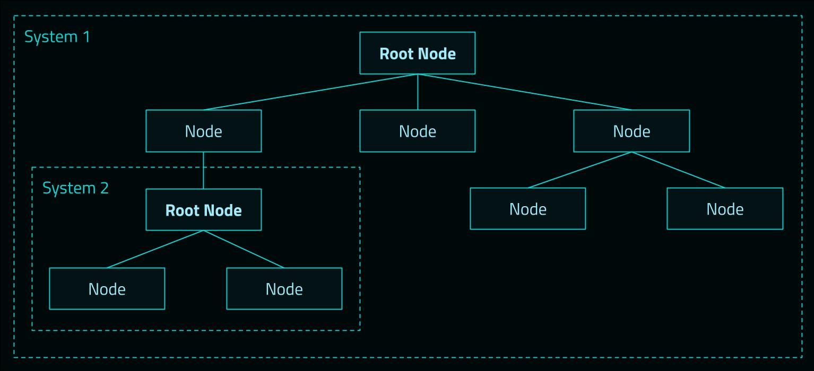

Arwes applications are rich in visual, animations, and sounds effects.

An animated, and audial UI application can be structured as a tree of nodes.

An Arwes system is a tree of nodes with one root node.

A root node can be controlled to be animated and play sounds programmatically.
A child node in a system has its animations and sounds controlled by its parent
node.

If a child node becomes a root, then it becomes independent from its parent and
it creates a new system.

A node represents an individual UI component with animations and optionally sounds.

By default, a root node is animated and audible. A root node with enabled animations
and sounds also enables them to its children nodes. If a root node has animations
and sounds disabled, then its children nodes will also have them disabled.

A system of nodes should be able to work with animations enabled and disabled.

Only if a node is animated, it can play sounds.

Any node in a system can use animations and sounds for many purposes.

If multiple nodes in a system play the same sound at the same time, the sound
should be played only once.

If a sound is playing and another node tries to play it again, the sound should
restarts.

## Transitions

A node can have multiple animation states. The node can transition from one state
to another with animations and sounds.

When an node transitions in, it should be assembled. It should feel as being
created part by part. A simple line will start as a point and get its final length
over a short period of time. Opacity can be used from 0 to 1 while animating but
should last very short in the beginning of the animation.

When a node transitions out, it should be disassembled. It should feel as if it
is being unmounted part by part. A simple line will shrink until it is a point
in a short period of time. Opacity can be used from 1 to 0 while animating,
but should last very short at the end of the animation.

Nodes transitioning in and out can have a sound effect lasting the time the
animations take.

When a system transitions in, nodes should transition in by their order of
depth. From parent nodes to children nodes. For example, first backgrounds,
then structural frames, then containers, and finally content. All nodes in
the same depth start transitioning in at the same time and should take the
same duration.

When a system transitions out, all nodes regardless of their level of depth,
should start transitioning out at the same time and should take the same duration.

All nodes in a system should support being animated or not. A non-animated node
should not have transition animations.

A system can take as many levels as needed. It is recommended to have as few as
possible.

A typical system may have 100ms transitions and 5 levels depth.

## Persistency

In a system, once it is assembled and shown, it can run randomly subtle passive
animations on its nodes regularly with very optional sounds.

Lines in a rectangular container can glow momentary in a system. A background
can be animated the whole time with subtle changes, and low dim music can be
played in the duration of the system.

But these animations should not be intrusive. User should not be distracted from
primary content.

## Interactions

When an external factor interacts with nodes in the system (such as user mouse
or keyboard, or real time notification), the nodes can affect themselves, such
as a toggle (changing from on to off and vice-versa), or they can affect a
sub-system, such as expanding information on hover or transitioning to another
system.

For subtle interactions, like hovering a node or typing a key, subtle animations
and sounds can be played. These should not bring too much attention.

For decisive interactions, like selecting an option or typing enter, more concise
animations and sounds can be played. These should bring attention.
